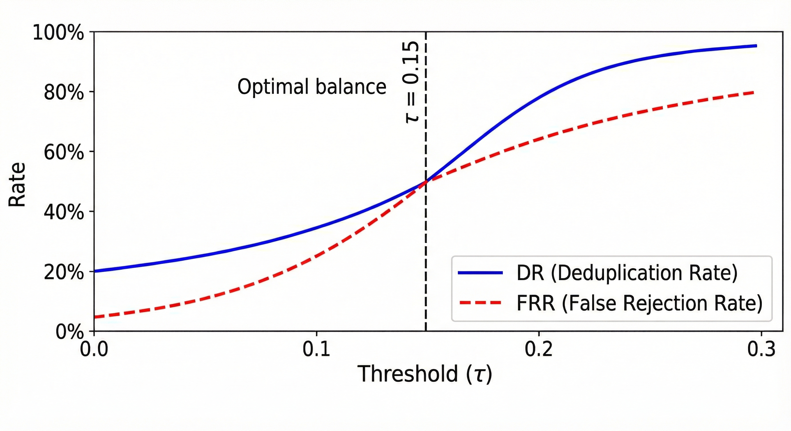

# Multi-Category Semantic Active Learning for Continuous Object Detection


## Abstract

Continuous multi-category object detectors deployed on live video streams must adapt to concept drift without catastrophic forgetting, control labeling costs, and avoid failures from relying on a single verifier model. This repository provides the official implementation of the **Multi-Category Active Continual Detection (MC-ACD)** system, which combines a category-aware semantic gatekeeper built on a vector database with an ensemble of Vision–Language Models (VLMs) for robust, cost-efficient verification.

The system embeds region-of-interest crops using ResNet‑18 into a 512-dimensional feature space, filters redundant samples via cosine similarity in ChromaDB, and verifies novel samples with a weighted ensemble of Gemini 2.5 Flash, GPT‑4 Vision, and Claude 3.5 Sonnet. On the **CL‑COCO‑80** 5-phase domain-incremental benchmark (80 MS‑COCO classes), MC‑ACD reaches **78.3% Average mAP**, limits forgetting to **12.8%**, and reduces labeling cost by **82%** relative to a naive baseline, while rejecting **71.4%** redundant captures and preserving real-time throughput.

---

## Key Contributions

- **MC‑ACD architecture** integrating continual object detection with vector-based semantic memory and ensemble VLM verification for multi-category video streams.

- **Category-Aware Semantic Gatekeeper** that performs per-class k‑NN search in ChromaDB using ResNet‑18 embeddings and a cosine similarity threshold τ=0.15, removing 71.4% redundant samples before expensive verification while retaining 95.7% of true positives.

- **Ensemble VLM Verification** that combines Gemini 2.5 Flash, GPT‑4 Vision, and Claude 3.5 Sonnet via adaptive weighted voting, achieving 94.2% verification accuracy and substantially higher worst-category accuracy than any individual model.

- **Class-balanced rehearsal and Deployment Reliability Gate (DRG)** that maintain 78.3% Average mAP with only 12.8% forgetting across 80 classes, and block deployments that would harm any individual category relative to the current baseline.

- **Economic viability analysis** showing an 82% reduction in effective labeling/verification costs per hour of 30 FPS video compared to naive active learning, while keeping real-time inference speed close to 120 FPS.

---

## System Overview

The MC‑ACD system is implemented as a closed-loop active learning pipeline operating on real-time video streams (nominally 30 FPS). A YOLOv11m detector provides base multi-category bounding-box predictions, which are post-processed by semantic gating, VLM verification, rehearsal-based continual training, and a deployment safety gate.

### High-Level Flow


### Pipeline Stages

1. **Multi-Category Detection**: YOLOv11m runs on the input stream, producing per-frame detections and category labels at real-time speeds.

2. **Category-aware ROI extraction**: Each detected region is cropped and tagged with its predicted category to support per-class semantic indexing.

3. **Semantic gatekeeper**: ROIs are embedded with ResNet‑18 into a 512‑dimensional space; per-category HNSW indices in ChromaDB provide approximate k‑NN with cosine similarity threshold τ=0.15.

4. **Ensemble VLM module**: Novel samples are sent in parallel to Gemini 2.5 Flash, GPT‑4 Vision, and Claude 3.5 Sonnet, whose decisions and confidence scores are aggregated via weighted majority voting.

5. **Rehearsal training**: Verified samples update both the vector database and a class-balanced rehearsal buffer used to periodically fine-tune the detector.

6. **Deployment Reliability Gate**: New models are deployed only if both global Average mAP and all per-category mAPs satisfy never-worse-than-baseline constraints.

---

## Core Components

### Category-Aware Semantic Gatekeeper

- **Embedding backbone**: ResNet‑18 produces 512‑dimensional feature vectors for each ROI; this provides a good speed–discriminability trade-off for intra-category variations.

- **Per-category vector indices**: Each of the 80 COCO categories maintains its own ChromaDB index, queried via HNSW for approximate k‑NN at k=5.

- **Novelty decision**: A candidate sample is treated as redundant if the minimum cosine distance to its k nearest neighbors in the same category falls below τ=0.15; otherwise, it is forwarded to the VLM ensemble.

**At τ=0.15, the gatekeeper:**
- Eliminates 71.4% of captured samples as redundant
- Preserves 95.7% of true positives required for effective continual learning
- Reduces VLM ensemble calls from 5,247 to 1,501, lowering verification cost from $78.71 to $22.52 per hour in the analyzed setup

### Ensemble VLM Verification

For each novel ROI, the system queries three VLMs in parallel and aggregates binary decisions with confidence scores using category-dependent weights.

**Backends:**
- Gemini 2.5 Flash (Google DeepMind)
- GPT‑4 Vision (OpenAI)
- Claude 3.5 Sonnet (Anthropic)

**Weighted majority voting:**
- Each model contributes a vote modulated by its confidence and a category-specific weight, learned from validation data
- The ensemble output is accepted as verified only when the weighted sum exceeds a threshold corresponding to a strict majority

**Measured verification performance:**
- Single VLM: ~86–88% mean verification accuracy, with some categories falling into the 58–65% range
- Ensemble: 94.2% overall accuracy with worst-category accuracy of 81.5%, improving reliability and reducing label noise for continual training

### Rehearsal and Continual Training

Verified samples are used to maintain a class-balanced rehearsal memory and to update the detector in a phase-wise manner.

- **Rehearsal buffer**: Up to 8,000 samples are stored with per-class quotas to avoid overrepresenting frequent categories
- **Triggering**: Training is triggered after accumulating a fixed number of verified samples per category or in total, ensuring that each update reflects a diverse mix of domains
- **Optimization**: Training uses AdamW, moderate epoch budgets, mosaic-style augmentation, and partial backbone unfreezing to balance plasticity and stability

### Deployment Reliability Gate (DRG)

The DRG enforces per-category safety constraints to prevent regressions:

- A new model must improve or maintain global Average mAP compared to the current deployed model
- For every category, mAP must not drop below a defined fraction of the current deployed mAP, bounding category-wise forgetting even if average metrics look good
- In experiments, the DRG prevented several candidate models from being deployed, where average mAP improved but some classes suffered large performance drops

---

## CL‑COCO‑80 Benchmark

The CL‑COCO‑80 benchmark is derived from MS‑COCO 2017 and consists of five domain-incremental phases covering all 80 categories.

- **Phase 0 – Baseline**: ~18.2k images under standard conditions with balanced category distribution
- **Phase 1 – Low-Light**: Images with challenging illumination such as evening and indoor low-light scenes
- **Phase 2 – Heavy Occlusion**: Crowded scenes with significant occlusion and partial visibility
- **Phase 3 – Novel Appearances**: Objects with unusual shapes, textures, or contexts to stress appearance generalization
- **Phase 4 – Adversarial Concealment**: Hard cases with deliberate concealment and camouflage representing extreme distribution shifts

Overall, the benchmark covers **33,955 images** across **80 categories**, arranged to produce progressive domain shift and increasing difficulty.

---

## Quantitative Results

### Performance on CL‑COCO‑80

Key metrics include Average mAP (Avg mAP), Average Forgetting (AF), labeling cost reduction, and throughput (FPS).

#### Detection and Cost Metrics (Selected Methods)

| Method | Avg mAP (%) | Forgetting (%) | Cost Reduction (%) | Notes |
|--------|-------------|----------------|-------------------|-------|
| YOLOv11 Static | 62.4 | 51.3 | 0 | Trained only on Phase 0, no adaptation |
| IncDet Baseline | 73.2 | 24.1 | 45 | Continual detector with distillation+replay |
| Single-VLM (best) | 75.3 | ~18.5–19.2 | 76–78 | MC‑ACD with a single VLM verifier |
| **MC‑ACD (Ours)** | **78.3** | **12.8** | **82** | Full system with gatekeeper + ensemble |

- MC‑ACD improves Avg mAP by 15.9 points over the static baseline and by 5.1 points over IncDet
- Average forgetting drops from 51.3% (static) and 24.1% (IncDet) to 12.8% with MC‑ACD


#### Deduplication Efficiency at τ=0.15

| Metric | Value | Impact |
|--------|-------|--------|
| Deduplication Rate | 71.4% | Reduces ensemble VLM calls from 5,247 to 1,501 per setup |
| True Positive Retention | 95.7% | Preserves critical training examples for stable continual learning |
| Effective Hourly Cost | $22.52 | Down from $78.71 in a configuration without the gatekeeper |



#### VLM Verification Accuracy

| Configuration | Overall Acc. (%) | Worst-Category Acc. (%) | Latency (s, parallel) |
|---------------|------------------|------------------------|---------------------|
| Gemini 2.5 Flash | 86.4 | 62.1 | ~2.1 |
| GPT‑4 Vision | 88.3 | 58.7 | ~3.4 |
| Claude 3.5 Sonnet | 87.1 | 65.3 | ~2.8 |
| **Ensemble (Ours)** | **94.2** | **81.5** | ~3.2 |

The ensemble reduces label noise compared to single-VLM approaches, which is critical for multi-phase continual learning.

---

## Reproducibility

The repository is structured to make it easy to reproduce the main experimental results reported in the paper on CL‑COCO‑80.

### 1. Environment Setup

```bash
git clone https://github.com/NayemHasanLoLMan/Semantic-Active-Learning-for-Continuous-Object-Detection.git
cd Semantic-Active-Learning-for-Continuous-Object-Detection
pip install -r requirements.txt
```

**Requirements:**
- Compatible GPU and CUDA stack for YOLOv11m and ResNet‑18 training/inference
- Configure credentials for Gemini, GPT‑4 Vision, and Claude APIs as indicated in the code or configuration files

### 2. CL‑COCO‑80 Dataset Generation

The script `dataset_creation.py` downloads MS‑COCO 2017 and constructs the five domain-incremental phases used in the paper.

```bash
python src/dataset_creation.py
```

- Generates approximately 33,955 images split into phases 0–4 under the `datasets/clcoco_phase0-4/` directory
- Uses the same phase definitions as described in the paper (baseline, low-light, occlusion, novel appearance, adversarial concealment)

### 3. Training (MC‑ACD Protocol)

Sequentially train MC‑ACD through all phases with semantic gating and rehearsal enabled.

```bash
# Phase 0: Base model
python src/train_mcacd.py --phase phase0 --seed 42

# Phases 1–4: Incremental adaptation
python src/train_mcacd.py --phase phase1 --seed 42
python src/train_mcacd.py --phase phase2 --seed 42
python src/train_mcacd.py --phase phase3 --seed 42
python src/train_mcacd.py --phase phase4 --seed 42
```

- Checkpoints are stored under `checkpoints/`, with phase-specific files used for evaluation
- The training loop integrates rehearsal sampling, gatekeeper updates, and DRG-based deployment checks in accordance with the methodology

### 4. Evaluation

To reproduce the end-of-phase metrics (e.g., Table I in the paper), run:

```bash
python src/eval_clcoco.py --model checkpoints/phase4.pt
```

This script computes Average mAP, Average Forgetting, deduplication rate, cost metrics, and other reporting statistics over CL‑COCO‑80.

---

## Repository Structure

The repository is partitioned into academic scripts that mirror the paper and prototype scripts suitable for live demos.

```
├── src/                        # Academic implementation (paper-aligned)
│   ├── dataset_creation.py     # CL-COCO-80 construction and phase splitting
│   ├── gatekeeper.py           # ResNet-18 embedding + ChromaDB semantic gating
│   ├── train_mcacd.py          # Rehearsal-based continual training loop
│   ├── eval_clcoco.py          # Metric computation for CL-COCO-80
│   └── vlm_ensemble.py         # VLM aggregation and weighted voting
│
├── scripts/                    # Prototype / demo utilities
│   ├── webcam_capture.py       # Real-time webcam or video capture
│   └── continuous_learning.py  # Orchestration for streaming demos
│
├── datasets/
│   ├── clcoco_phase0-4/        # Generated benchmark splits
│   └── chroma_db/              # Vector indices (created at runtime)
│
├── requirements.txt            # Python dependencies
└── README.md                   # This document
```

---

## Practical Deployment Notes

- **Throughput**: The per-frame pipeline (detector + embedding + k‑NN) has a total latency around 70–80 ms in the reported setup, supporting real-time operation at approximately 120 FPS when VLM calls are handled asynchronously.

- **Cost management**: Semantic deduplication and batching of VLM queries are essential to keep API usage and monetary cost within acceptable bounds for long-term deployment.

- **Scalability**: The category-aware indexing strategy and DRG are designed to extend beyond 80 categories; future work may target 1,000-class hierarchies and edge deployment with open-source VLMs.

---

## Citation

If you use this repository, CL‑COCO‑80, or the MC‑ACD methodology in your research, please cite:

```bibtex
@article{mahmood2021multi,
  title   = {Multi-Category Semantic Active Learning for Continuous Object Detection: A Vector-Based Deduplication Framework with Ensemble VLM Verification},
  author  = {Mahmood, Hasan},
  journal = { },
  volume  = { },
  number  = { },
  year    = { }
}
```

*Please ensure the final bibliographic fields (journal, volume, year, etc.) match the published version of your paper.*

---

## Acknowledgments

This work builds on open-source contributions and commercial APIs that made the system feasible at both the research and prototype stages. The author thanks:

- **Ultralytics** for the YOLOv11 implementation used as the base detector
- **ChromaDB** for the vector database backend enabling low-latency semantic deduplication
- **Google DeepMind, OpenAI, and Anthropic** for providing access to Gemini, GPT‑4 Vision, and Claude VLM APIs used in the ensemble verification module
- The broader open-source and research communities whose work on continual learning, active learning, and VLMs informed the system design

---

## License

MIT License - See [LICENSE](LICENSE) file for details.

## Contact

For questions or issues, please open an issue on GitHub or contact: hasanmahmudnayeem3027@gmail.com
